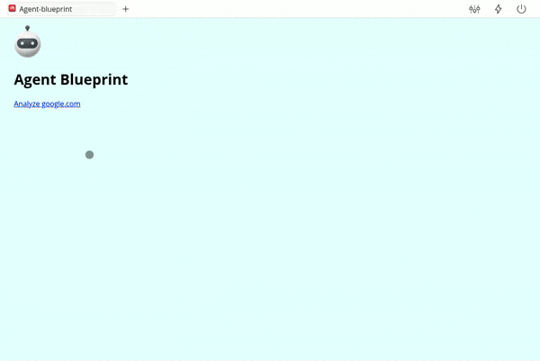

# Webfuse Agent Blueprint

This is a minimal Webfuse AI web agent extension blueprint.

> The blueprint extension simply summarizes the currently browsed web page.

## Setup

1. Copy template repository.
2. Clone repository to local machine.
3. Change working directory to repository directory.
4. Create `.env` file in root directory and provide credentials (compare `.env.example`).
5. Run `npm install`.

## Tuning

Customize the backend LLM system prompt in [`SYSTEM_PROMPT.md`](./src/background/SYSTEM_PROMPT.md) according to individual requirements.

## Workflow

1. Run `npm run bundle:debug`.
2. Open preview URL in browser.

> The extension is built with the [Labs](https://www.webfuse.com/labs) framework.

## Deploy

1. Run `npm run bundle`.
2. Upload `dist` directory to Webfuse Space (via Session UI).

> Production bundles do not copy environmental variables, but require manual provision via Session UI.

## 

