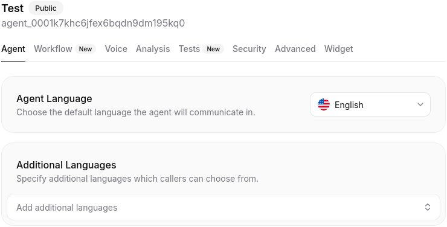
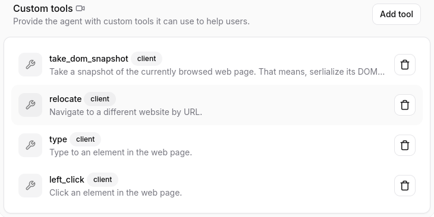
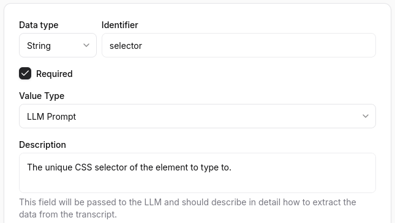

# Webfuse ElevenLabs Agent

<a href="https://webfuse.com"></a>

This is an [ElevenLabs](https://elevenlabs.io) +  [Webfuse](https://www.webfuse.com) voice AI agent extension.

## with ElevenLabs

### 1. Create and configure agent

<a href="https://elevenlabs.io/app/agents">
  
</a>

### 2. Provide agent ID to `env` in [`manifest.json`](./manifest.json)

``` json
{
  "env": [
    {
      "key": "AGENT_KEY",
      "value": "agent_0123abcdefghijklomnopqrstuvwxyz"
    }
  ]
}
```

### 3. Create tools for the [Automation API](https://dev.webfuse.com/automation-api)

<a href="https://elevenlabs.io/app/agents">
  
</a>

### 4. Align tools with [`popup.js`](./popup.js)

<a href="https://elevenlabs.io/app/agents">
  
</a>

## with Webfuse

### 1. Create a Webfuse [Space](https://dev.webfuse.com/spaces-sessions)

### 2. Deploy this [Extension](https://dev.webfuse.com/extensions) project